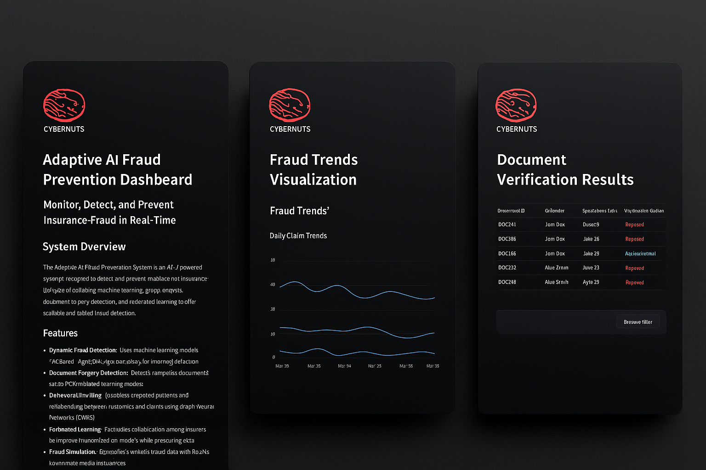

# 🛡️ Adaptive AI Fraud Prevention System

**Monitor, Detect, and Prevent Insurance Fraud Using AI in Real-Time**

  
  
  


---

## 🔍 Overview

The **Adaptive AI Fraud Prevention System** is a comprehensive and scalable solution that leverages advanced AI technologies to identify and mitigate fraudulent activities throughout the insurance lifecycle. It integrates machine learning, document forensics, graph-based behavioral analysis, and federated learning to deliver real-time fraud intelligence.



---

## ⚙️ Features

- ✅ **Dynamic Fraud Detection**  
  Employs ML models like XGBoost, LightGBM, and Autoencoders to detect anomalies and score fraud risk.

- 🧾 **Document Forgery Detection**  
  Detects tampered or altered documents using OCR pipelines and deep learning models.

- 🧠 **Behavioral Profiling**  
  Utilizes Graph Neural Networks (GNNs) to analyze relationships between entities and identify collusion rings.

- 🔐 **Federated Learning**  
  Enables insurers to collaboratively train models without exposing sensitive data.

- 🧪 **Fraud Simulation**  
  Uses Generative Adversarial Networks (GANs) to synthesize fraud scenarios for robust training.

- ⚡ **Real-Time Detection**  
  Integrates lightweight models at the ingestion stage for instant flagging.

- 📊 **Interactive Dashboard**  
  Built with **Streamlit**, offering real-time visualization of fraud trends and alert systems.

---

## 🚀 Demo

> Here's a quick preview of the system UI (mockup):

  
*Interactive dashboard showcasing real-time alerts, document verification, and fraud trends.*

---

## 🧰 Tech Stack

- **Frontend/UI**: Streamlit  
- **Machine Learning**: Scikit-learn, XGBoost, LightGBM, Autoencoders  
- **Deep Learning**: PyTorch / TensorFlow  
- **Graph AI**: PyTorch Geometric / DGL  
- **OCR**: Tesseract / EasyOCR  
- **Data Management**: Pandas, NumPy  
- **Model Sharing**: Federated Learning via Flower or PySyft

---

## 🛠️ Installation & Setup

### 1. Clone the Repository
```bash
git clone https://github.com/yourusername/adaptive-ai-fraud-prevention.git
cd adaptive-ai-fraud-prevention
```

### 2. Create a Conda Environment
```bash
conda env create -f environment.yml
conda activate fraud-detection
```

> ✅ If you're not using Conda, create a virtual environment manually and install dependencies via `pip`.

### 3. Install Additional Python Dependencies
```bash
pip install -r requirements.txt
```

### 4. Run the Project
```bash
streamlit run app.py
```

> 📝 You can also test specific modules using:
```bash
python test.py
```

---

## 📁 Project Structure

```
adaptive-ai-fraud-prevention/
│
├── app.py                    # Main Streamlit app
├── test.py                   # Test module for models
├── models/                   # Trained ML/DL models
├── utils/                    # Preprocessing and helper functions
├── data/                     # Sample datasets
├── assets/                   # Images & mockups
├── environment.yml           # Conda environment file
└── requirements.txt          # Pip requirements
```

---

## 🧪 Coming Soon

- 🔁 API Integration for Insurance Databases  
- 📱 Mobile-responsive Dashboard  
- 🌐 Cloud Deployment with Docker + GCP  

---

## 🤝 Contributors
- [@Mrigank118](https://github.com/Mrigank118)  
- [@Jainritikaa](https://github.com/Jainritikaa)

---

## 📄 License

This project is licensed under the MIT License. See `LICENSE` for more info.
```
